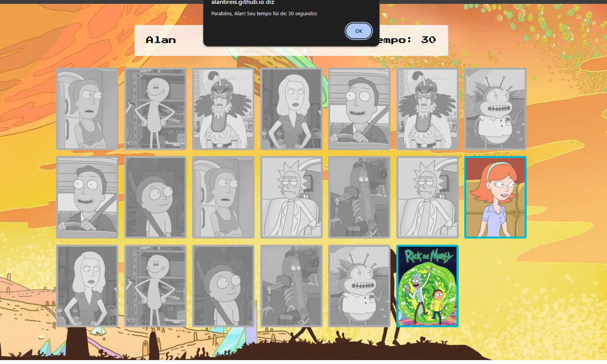

# Jogo da Memória - Rick & Morty


Um divertido jogo da memória inspirado na série Rick & Morty, desenvolvido com **HTML, CSS e JavaScript**.

## ✨ Funcionalidades
- Encontre todos os pares de cartas para vencer o jogo.
- Imagens dinâmicas dos personagens da série.
- Efeitos visuais e animações para uma experiência mais interativa.

## 📚 Tecnologias Utilizadas
- **HTML5**: Estrutura da página.
- **CSS3**: Estilização e animações.
- **JavaScript**: Lógica do jogo.

## 🚀 Como Rodar o Projeto
1. Clone o repositório:
   ```bash
   git clone https://github.com/SeuUsuario/rick-morty-memory-game.git
   ```
2. Acesse a pasta do projeto:
   ```bash
   cd rick-morty-memory-game
   ```
3. Abra o arquivo `index.html` no navegador.

## 🚪 Implementação DevOps
- **Docker**: Contêiner para rodar o jogo localmente.
- **CI/CD**: Pipeline com GitHub Actions para fazer o deploy automático.
- **Terraform**: Provisionamento automático na AWS.
- **Cloud**: Hospede o jogo em um bucket S3 na AWS ou no Azure Static Web Apps.
- **Monitoramento**: Utilize Prometheus + Grafana para coletar métricas de uso.

## 🛠️ Melhorias Futuras
- Adicionar ranking de jogadores.

---
👨‍💻 **Desenvolvido por [Alan Reis](https://github.com/AlanBReis)** 

